# AuditoriumX – Offline Theater Booking System (Electron)

[](https://github.com/Crackedwarrior/offlinebooking/actions/workflows/ci.yml)


Production-ready offline booking system for single-screen theaters, built with React, Electron, Node.js, and SQLite.  
Used daily in real theater operations for seat management, show scheduling, bilingual (English/Kannada) ticket printing, and real-time reporting.

---

## In Production
- Actively deployed and used by Sree Lekha Enterprises, Chikmagalur, processing over 2,000 real ticket bookings per day across four house-full shows.
- Offline-first design ensures uninterrupted operations during network outages.
- Optimized for low-resource Windows systems, providing fast startup and minimal background usage.

---

## Download
- Windows installer available under [GitHub Releases](https://github.com/Crackedwarrior/offlinebooking/releases).
- Or build locally (see "Build installer" below). After installation, the app resides at:  
  `C:\Users\<YourUser>\AppData\Local\Programs\AuditoriumX`

---

## Tech Stack
**Frontend:** React 18, TypeScript, Vite, Tailwind CSS, Radix UI, Zustand, TanStack Query  
**Desktop:** Electron 37  
**Backend:** Node.js, Express.js, Prisma ORM, SQLite (file-based)  
**Printing:** PDFKit, ESC/POS (Epson TM-T82), SumatraPDF for silent printing

---

## Key Tools and Dependencies
- [Electron](https://www.electronjs.org/) – Packaging and deploying desktop applications
- [Vite](https://vitejs.dev/) – Fast build and development environment
- [Prisma](https://www.prisma.io/) with SQLite – Local relational data storage
- [PDFKit](https://pdfkit.org/) – Ticket generation and custom templates
- Kannada ticket layout – Custom PDF rendering pipeline
- ESC/POS stack – Native thermal printing (EPSON TM-T82)
- [SumatraPDF](https://www.sumatrapdfreader.org) – External viewer for silent printing on Windows  
  *Licensing note:* SumatraPDF is open-source under GPLv3. The app detects an existing local installation and does not bundle binaries. If you redistribute SumatraPDF binaries yourself, follow GPLv3 terms.

---

## Features
- Real-time seat grid management for 590 seats across five seat classes
- Smart show transitions with manual override and triple-click recovery
- English and Kannada ticket printing via PDFKit or thermal ESC/POS
- Dynamic seat-class pricing and automated GST calculation
- Offline-first local database with daily backups and data integrity checks
- Real-time reporting and analytics for occupancy, revenue, and show performance

---

## Operational Impact
- Processes more than 2,000 ticket bookings per day in live production.
- Improved booking workflow efficiency by approximately 40%.
- Reduced manual seat allocation errors and eliminated double-bookings.
- Full offline reliability ensures uninterrupted ticketing operations.

---

## Documentation
| Type | File |
|------|------|
| User Guide | [docs/USER_MANUAL.md](docs/USER_MANUAL.md) |
| Technical Documentation | [docs/TECHNICAL_DOCUMENTATION.md](docs/TECHNICAL_DOCUMENTATION.md) |
| Deployment Guide | [docs/PRODUCTION_DEPLOYMENT_GUIDE.md](docs/PRODUCTION_DEPLOYMENT_GUIDE.md) |
| Troubleshooting | [docs/MONITORING_TROUBLESHOOTING_GUIDE.md](docs/MONITORING_TROUBLESHOOTING_GUIDE.md) |
| API Reference | [docs/API_DOCUMENTATION.md](docs/API_DOCUMENTATION.md) |

---

## Getting Started (Windows)
**Prerequisites:** Node.js 18+ (x64), npm, Windows 10/11

```bash
# 1) Install all dependencies (root, backend, frontend)
npm run install:all

# 2) Start backend server (in one terminal)
cd backend ; npm run dev

# 3) Start Electron app (in another terminal)
cd frontend ; npm run electron:dev
```

Alternative (backend + web development mode):

```bash
npm run dev   # runs backend + frontend web version
```

---

## Build Installer

From the frontend directory:

```bash
cd frontend
npm run installer
```

The installer is generated at:

```
frontend/dist-installer/AuditoriumX-Installer.exe
```

---

## Repository Structure

```
backend/         # Node/Express server, Prisma, print services
├── src/
│   ├── controllers/    # API route handlers
│   ├── routes/         # Express route definitions
│   ├── services/       # Business logic services
│   ├── middleware/     # Express middleware
│   ├── db/             # Database utilities
│   ├── types/          # TypeScript definitions
│   └── utils/          # Helper utilities
├── prisma/             # Database schema and migrations
├── tests/              # Jest/Vitest test cases for backend modules
├── fonts/              # Kannada fonts for ticket printing
└── dist/               # Compiled JavaScript output

frontend/       # React UI + Electron entry point and build configuration
├── src/
│   ├── components/     # Reusable UI components
│   ├── pages/          # Main application pages
│   ├── store/          # Zustand state management
│   ├── services/       # API and printer services
│   └── utils/          # Helper utilities
├── electron/           # Electron main process files
├── scripts/            # Build and deployment scripts
└── dist/               # Built frontend assets

docs/           # Comprehensive documentation
├── screenshots/                    # Application screenshots and demos
├── USER_MANUAL.md                  # End-user guide
├── TECHNICAL_DOCUMENTATION.md      # Developer guide
├── API_DOCUMENTATION.md            # API reference
├── SEAT_LAYOUT.md                  # Theater seat layout
└── PRODUCTION_DEPLOYMENT_GUIDE.md  # Deployment guide

build/          # App icons/assets
scripts/        # Utility scripts
.github/        # GitHub Actions CI/CD
```

---

## Printing

* PDF ticket generation with automatic printer detection
* Silent printing via SumatraPDF integration
* Native ESC/POS support for EPSON TM-T82 thermal printers
* 12-hour timestamp formatting for locale consistency

---

## Screenshots

### Authentication
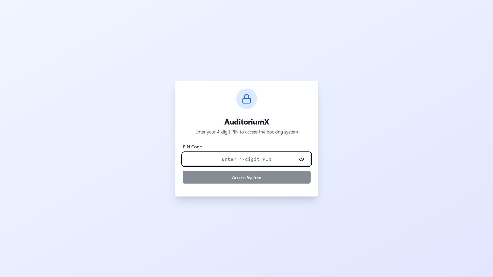
*Secure admin login with password protection for theater management access*

### Checkout Page
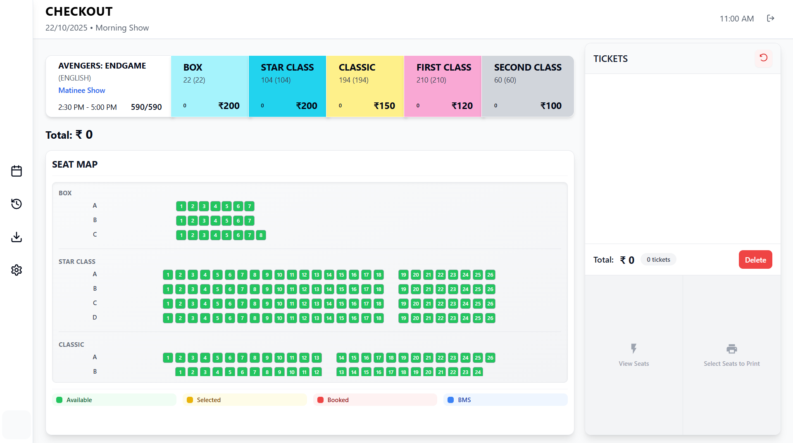
*Streamlined checkout interface with customer details and payment processing*

### Seat Grid - View 1
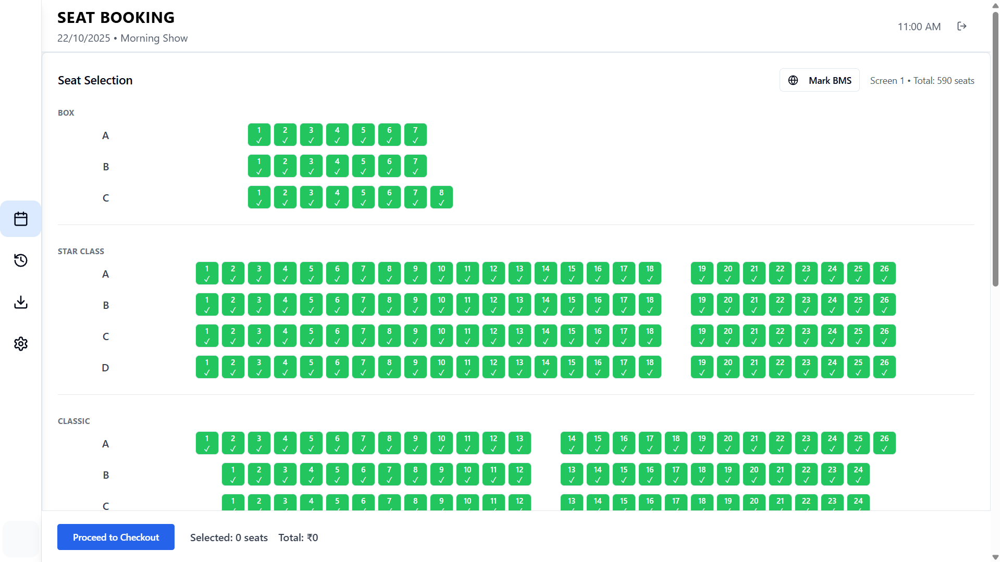
*Interactive seat selection grid showing real-time availability and pricing*

### Seat Grid - View 2
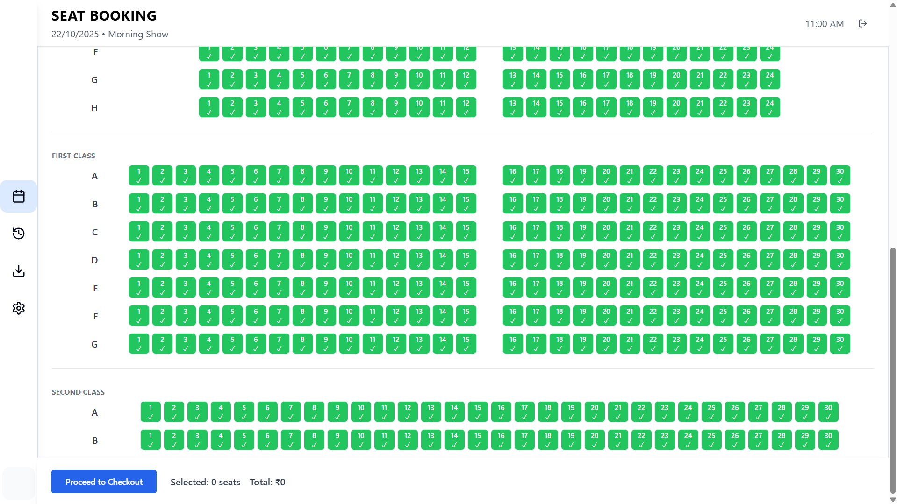
*Complete 590-seat layout: [View Detailed Seat Map](docs/SEAT_LAYOUT.md)*

### Booking History
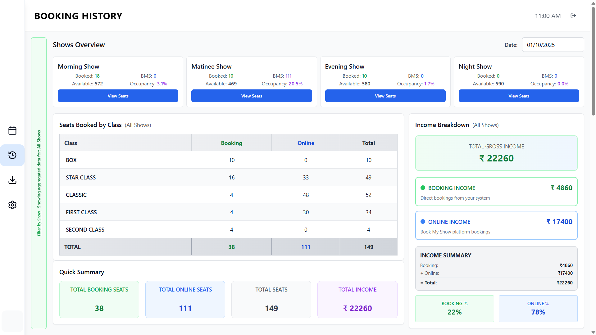
*Comprehensive transaction history with search, filter, and management tools*

### Reports and Analytics
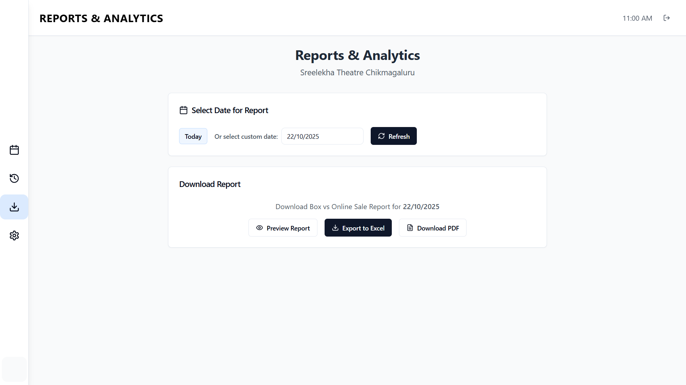
*Revenue analytics dashboard with performance metrics and financial insights*

### Analytics Preview
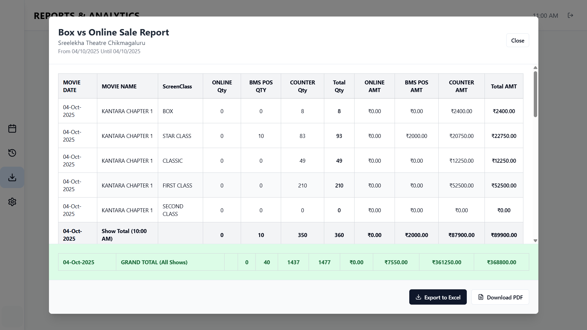
*Sample Report: [View HTML Report](docs/screenshots/sample-report.html) - Download to see report*

### Settings - Overview
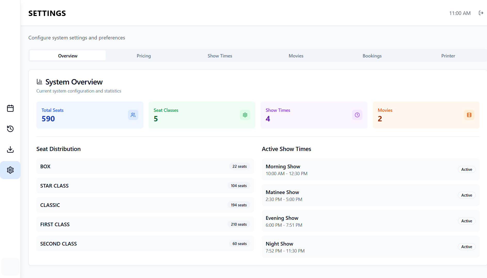
*Central configuration panel for all theater management settings*

### Settings - Pricing
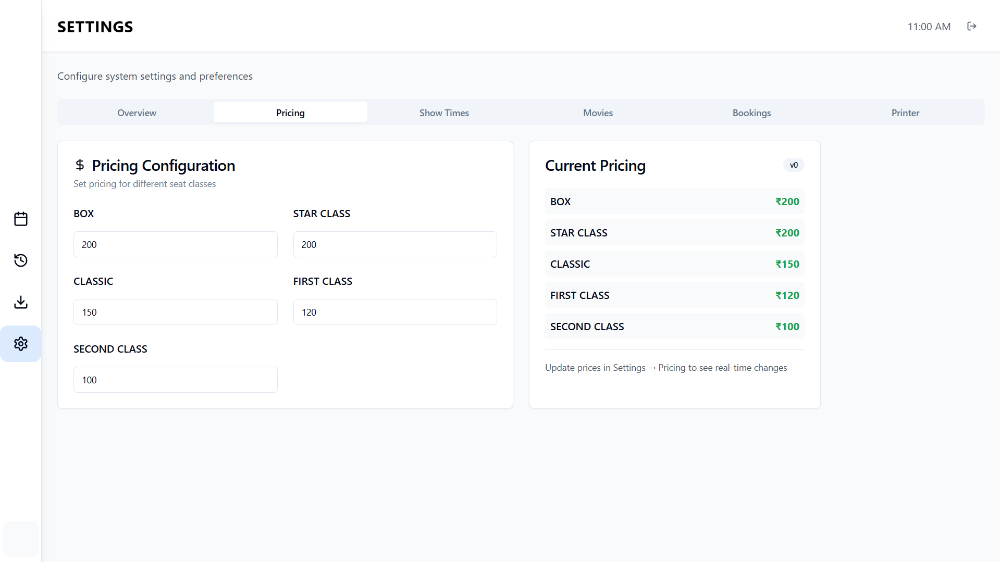
*Dynamic pricing configuration for different seat categories and show times*

### Settings - Show Times

*Flexible show schedule management with automatic transitions*

### Settings - Movie Schedule
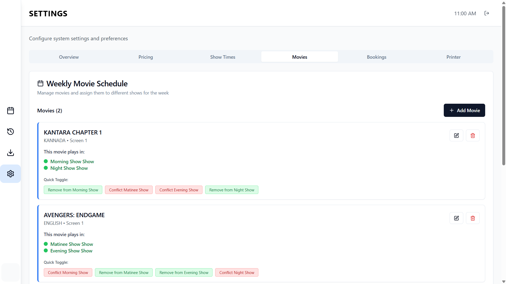
*Movie management system with poster support and scheduling tools*

### Settings - Booking Management
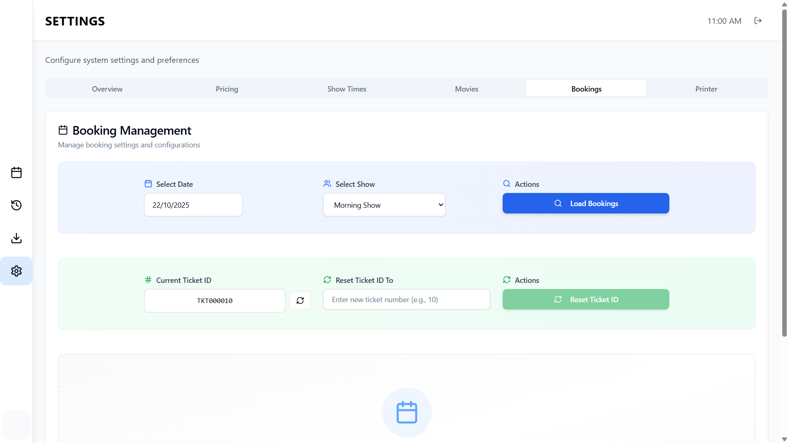
*Advanced booking controls including previous booking loading and management*

### Settings - Printer Configuration
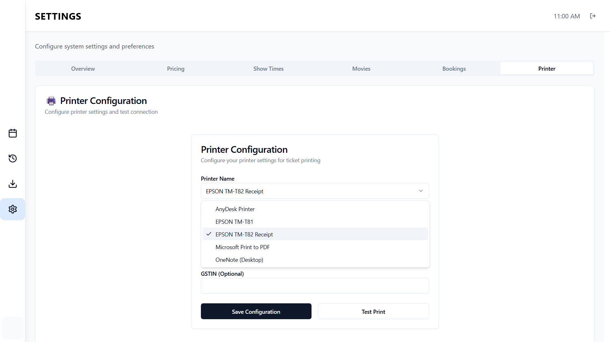
*Thermal printer setup for bilingual ticket printing in English and Kannada*

---

## Sample Tickets

<div align="center">
  <table>
    <tr>
      <td align="center">
        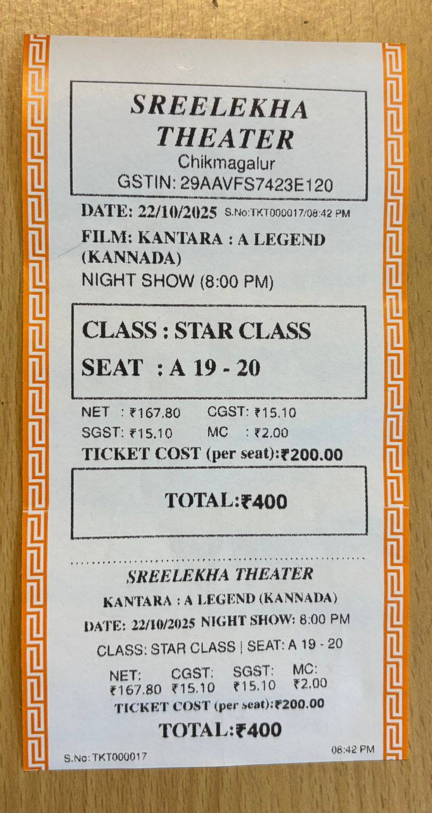
        <br><em>English Ticket</em>
      </td>
      <td align="center">
        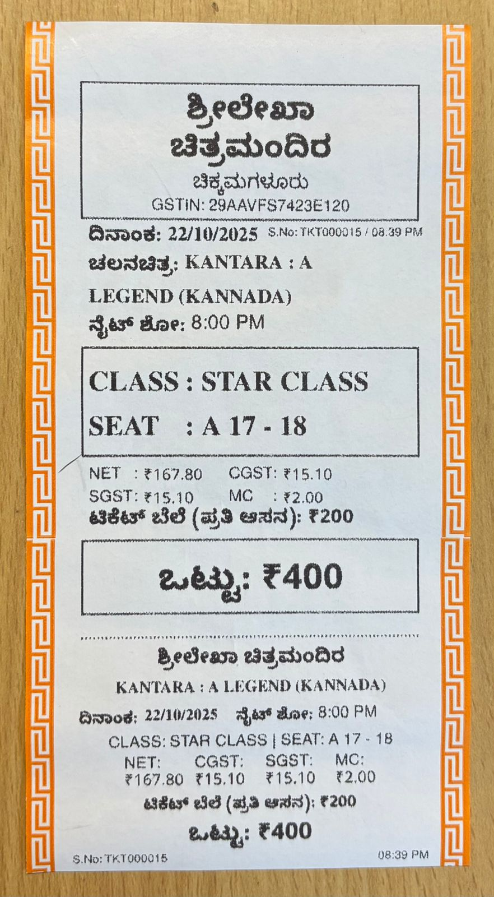
        <br><em>Kannada Ticket</em>
      </td>
    </tr>
  </table>
</div>

*Sample tickets showing theater details, seat information, and bilingual support for local theater operations*

---

## Demo Videos

* [Seat Selection Flow](docs/screenshots/demo-seat-selection.mp4) – Complete booking flow including seat grid interaction
* [Checkout Process](docs/screenshots/demo-checkout-flow.mp4) – Checkout and payment workflow demonstration

---

## Continuous Integration

Automated CI/CD pipeline using GitHub Actions for build and quality checks.
Future updates will include automated testing for backend services and frontend linting.

---

## Testing

Basic automated tests implemented using Jest/Vitest for backend modules.
These include API health checks, booking logic validation, and database integrity tests.

Run tests locally:

```bash
cd backend
npm test
```

All tests run automatically in the CI/CD workflow on each commit.

---

## License

Copyright (c) 2025 Crackedwarrior. All rights reserved.

For licensing inquiries, please contact the repository owner.