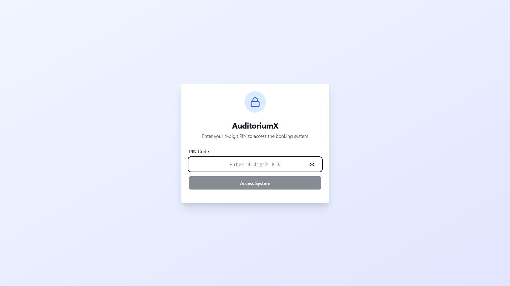
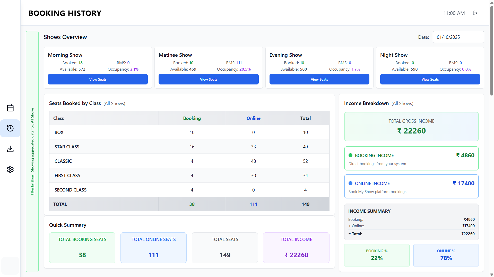
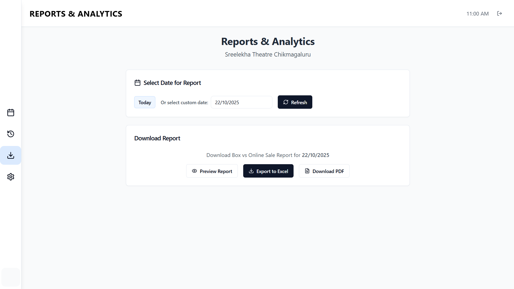
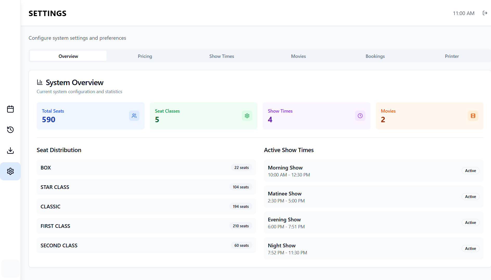
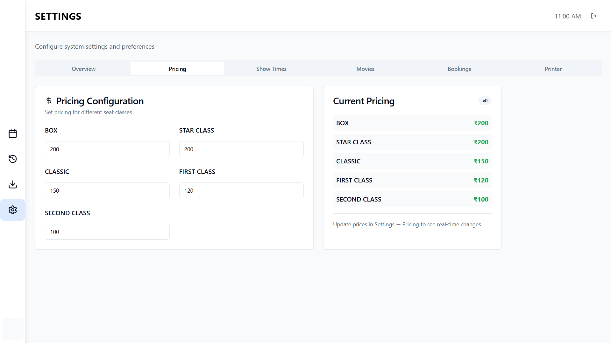
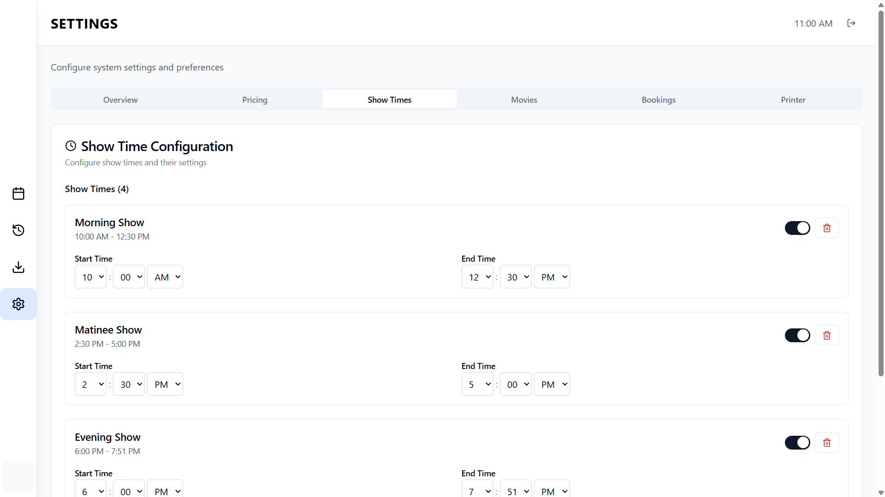
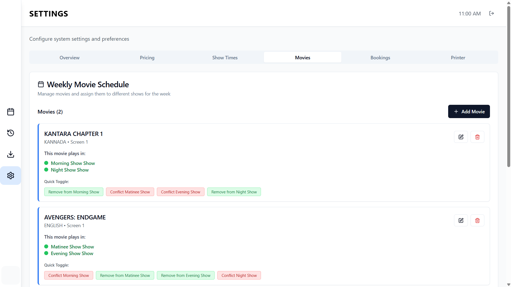
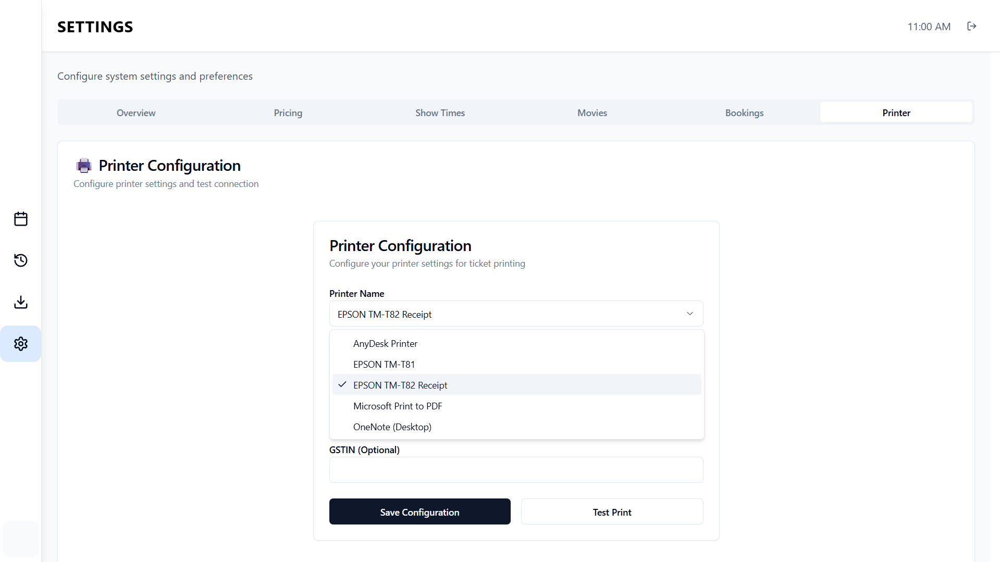

# AuditoriumX – Offline Theater Booking (Electron)

Professional desktop app for single‑screen theaters: seat grid booking, smart show management, and English/Kannada ticket printing. Built with React + Electron, Node/Express backend, and a local SQLite database.

## In production
- Deployed and used in a live single‑screen theater environment for daily operations (offline‑first, prints real tickets, handles live seat status, and backup/restore).
- Designed for low‑resource Windows machines; fast startup and minimal background activity.

## Download
- Windows installer: see [GitHub Releases](https://github.com/Crackedwarrior/offlinebooking/releases).
- Or build locally (see Build installer below). After install, the app lives at:
  `C:\Users\<YourUser>\AppData\Local\Programs\AuditoriumX`.

## Tech stack
- Frontend: React 18, TypeScript, Vite, Tailwind, Radix UI, Zustand, TanStack Query
- Desktop: Electron 37
- Backend: Node.js + Express, Prisma ORM, SQLite (file‑based)
- Printing: PDFKit (PDF), ESC/POS (Epson TM‑T82), SumatraPDF for silent PDF printing

## Key tools & dependencies
- [Electron](https://www.electronjs.org/) – packaging desktop app
- [Vite](https://vitejs.dev/) – fast dev/build
- [Prisma](https://www.prisma.io/) + SQLite – local data store
- [PDFKit](https://pdfkit.org/) – ticket PDF generation (English)
- Kannada ticket layout – custom PDF pipeline
- ESC/POS stack – thermal printing (e.g., EPSON TM‑T82)
- [SumatraPDF](https://www.sumatrapdfreader.org) – external viewer used for silent PDF printing on Windows
  - Licensing note: SumatraPDF is open‑source under GPLv3. We do not bundle or redistribute Sumatra in this repository; the app detects an existing local installation. Mentioning/integrating it is fine. If you redistribute Sumatra binaries yourself, follow GPLv3 terms.

## Features
- Smart show transitions at exact start times, with manual override and triple‑click return
- Show availability rules (current + next), persistent selection
- English and Kannada ticket printing (PDFKit/Thermal ESC/POS)
- Consistent 12‑hour time formatting across systems
- Offline‑first local DB with daily backup and health checks

## Quick links
- User guide: [docs/USER_MANUAL.md](docs/USER_MANUAL.md)
- Technical docs: [docs/TECHNICAL_DOCUMENTATION.md](docs/TECHNICAL_DOCUMENTATION.md)
- Deployment guide: [docs/PRODUCTION_DEPLOYMENT_GUIDE.md](docs/PRODUCTION_DEPLOYMENT_GUIDE.md)
- Troubleshooting: [docs/MONITORING_TROUBLESHOOTING_GUIDE.md](docs/MONITORING_TROUBLESHOOTING_GUIDE.md)
- API docs: [docs/API_DOCUMENTATION.md](docs/API_DOCUMENTATION.md)

## Getting started (Windows)
Prerequisites: Node.js 18+ (x64), npm, Windows 10/11.

```bash
# 1) Install all dependencies (root, backend, frontend)
npm run install:all

# 2) Run the Electron app in development
npm run dev:desktop
```

Backend + web dev alternative:
```bash
npm run dev           # runs backend + frontend web
```

## Build installer
From the repo root:
```bash
npm run electron:dist
```
The installer is generated at:
```
frontend/dist-installer-v18/AuditoriumX-Installer.exe
```

## Repository structure
```
backend/         # Node/Express server, Prisma, print services
frontend/        # React UI + Electron entrypoint and builder config
build/           # App icons/assets
scripts/         # Utility scripts
docs *.md        # Guides (see Quick links above)
```

## Printing
- PDF tickets via SumatraPDF auto‑detection (silent print)
- Thermal printing supported (e.g., EPSON TM‑T82)
- Time on tickets uses manual 12‑hour formatting to avoid locale issues

## 📸 Screenshots

<div align="center">

### Main Interface

*Clean booking dashboard with movie selection and show management*

### Seat Selection

*Interactive seat grid with category-based pricing and real-time availability*

### Active Booking

*Live seat selection with visual feedback and pricing calculation*

### Checkout

*Streamlined checkout with customer details and payment summary*

### Settings - Movies

*Comprehensive movie management with poster support*

### Settings - Show Times

*Flexible show time configuration with auto-transitions*

### Settings - Pricing

*Dynamic pricing management for different seat categories*

### Booking Management

*Complete booking history and ticket ID management*

### Ticket Print

*Professional thermal ticket printing in English and Kannada (Coming soon)*

</div>

---

## 🎬 Demo Videos

**Complete Booking Flow:**
- [Booking Demo 1](docs/screenshots/booking-demo-1.mp4) - Full booking process from seat selection to payment
- [Booking Demo 2](docs/screenshots/booking-demo-2.mp4) - Settings management and configuration

*Note: Download and play the MP4 files to see the app in action*
